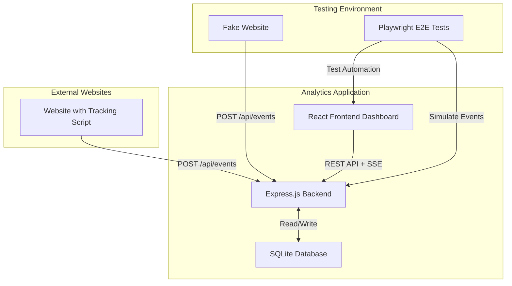
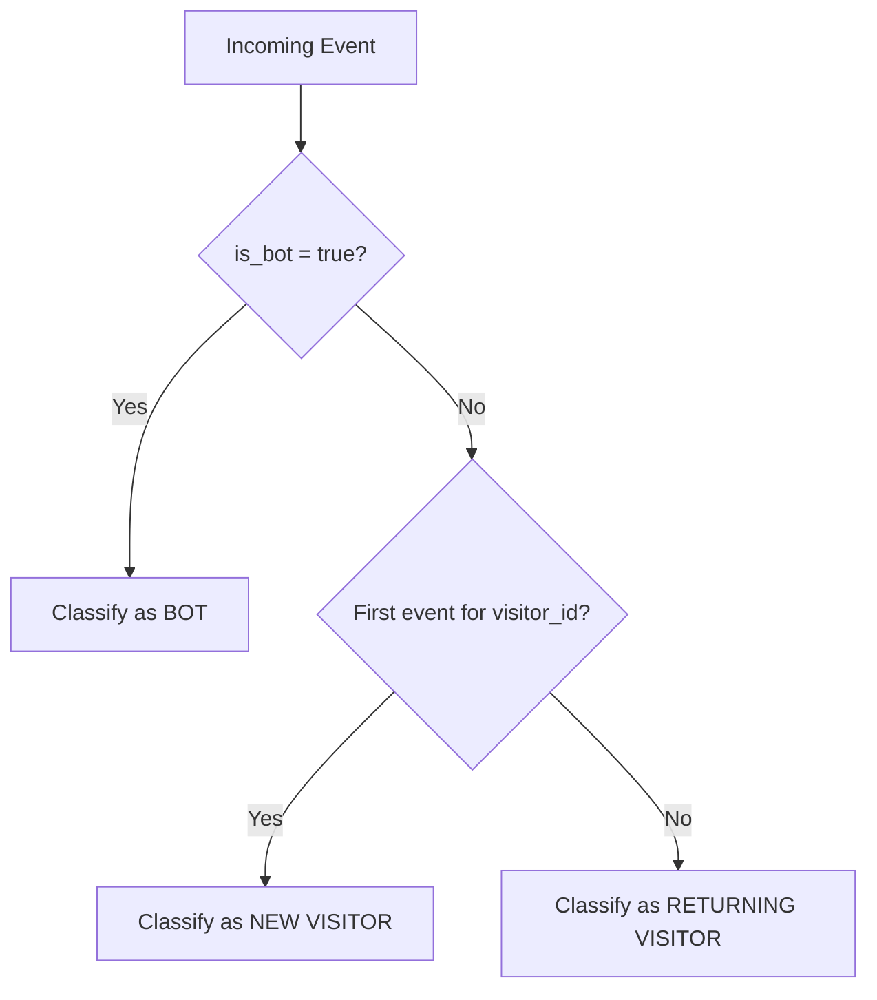
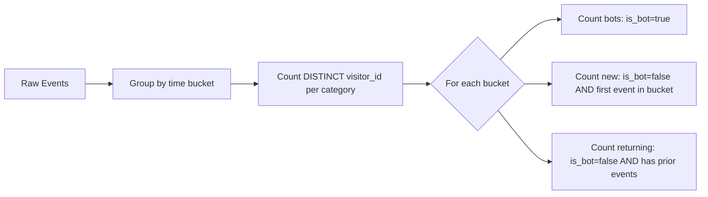
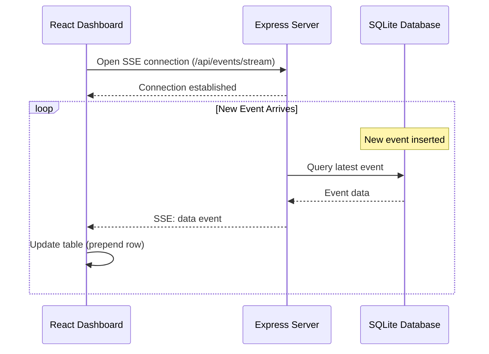
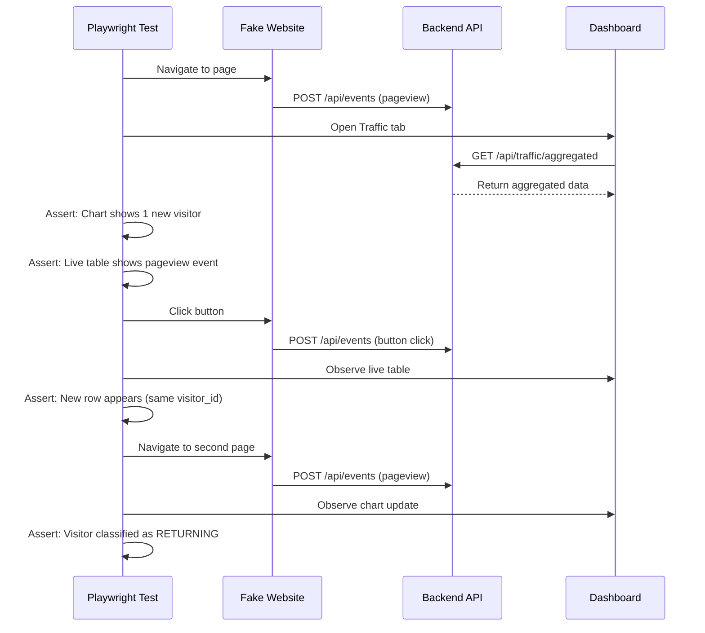
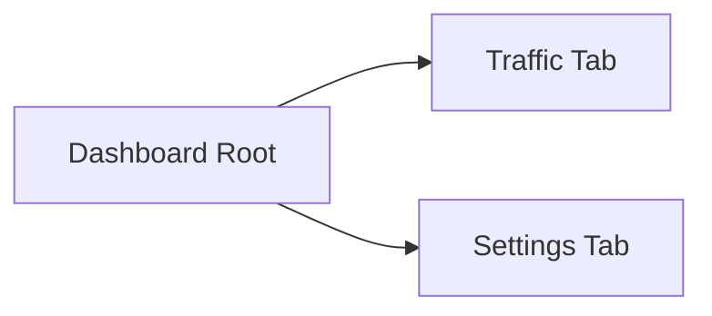
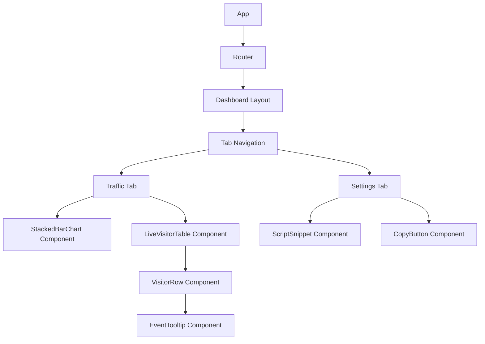

# Dashboard Traffic & Settings Feature Design

## Overview

Design for a web analytics dashboard application with real-time visitor tracking, bot detection, and event monitoring capabilities. The application consists of a two-tab dashboard interface displaying traffic analytics and embedding configuration.

## Business Goals

- Provide real-time visibility into website traffic patterns
- Distinguish between legitimate users, returning visitors, and automated bots
- Enable easy integration via script snippet for external websites
- Support comprehensive event tracking with detailed visitor metadata

## System Architecture

### High-Level Components



### Technology Stack

| Layer | Technology | Purpose |
|-------|------------|---------|
| Backend | Express.js (Node.js) | HTTP server, API endpoints, SSE streaming |
| Frontend | React + React Router | Dashboard UI and navigation |
| UI Components | Radix UI | Accessible, unstyled component primitives |
| Database | SQLite | Event storage and querying |
| Testing | Playwright | End-to-end testing framework |
| Tracking Script | Vanilla JavaScript | Client-side event capture |

## Data Model

### Event Entity

Represents each tracked interaction or page view from monitored websites.

| Field | Type | Description | Derivation |
|-------|------|-------------|------------|
| id | INTEGER PRIMARY KEY | Auto-incrementing unique identifier | Database auto-generated |
| timestamp | INTEGER | Event occurrence time in milliseconds | Client-side Date.now() |
| visitor_id | TEXT | Unique visitor identifier | SHA-256 hash of (IP + User Agent) |
| event_type | TEXT | Type of interaction | button, link, pageview, etc. |
| page | TEXT | URL of the page where event occurred | window.location.href |
| referrer | TEXT | Referring URL | document.referrer |
| country | TEXT | Two-letter country code | navigator.language or Intl.DateTimeFormat |
| os | TEXT | Operating system | Parsed from User Agent |
| browser | TEXT | Browser name and version | Parsed from User Agent |
| device_type | TEXT | Device category | PC or MOBILE (from User Agent) |
| resolution | TEXT | Screen resolution | screen.width x screen.height |
| timezone | TEXT | Client timezone | Intl.DateTimeFormat().resolvedOptions().timeZone |
| page_load | INTEGER | Page load time in milliseconds | performance.timing calculation |
| is_bot | BOOLEAN | Bot detection flag | Match User Agent against bot patterns |
| user_agent | TEXT | Full User Agent string | navigator.userAgent |

### Visitor Classification Logic



**Classification Rules:**
- **Bot**: is_bot flag is true (User Agent matches known crawler patterns)
- **New Visitor**: First event recorded for this visitor_id (no previous events in database)
- **Returning Visitor**: visitor_id has existing events in database and is_bot is false

## Feature Specifications

### Tab 1: Traffic Dashboard

#### Stacked Bar Chart

**Visualization Requirements:**
- Chart Type: Stacked vertical bar chart
- Time Granularity: Configurable (hourly, daily, weekly buckets)
- Metric: Unique visitor count per time bucket
- Stack Order (bottom to top):
  1. Bots (red) - bottom layer
  2. New Visitors (green) - middle layer  
  3. Returning Visitors (blue) - top layer

**Data Aggregation Strategy:**



**Counting Logic:**
- Only count unique visitor_id values within each category per time bucket
- A visitor_id can only appear in one category per bucket (priority: bot > new > returning)
- Chart updates periodically via API polling or SSE updates

#### Live Visitor Table

**Table Columns:**

| Column | Display Value | Data Source |
|--------|---------------|-------------|
| Time | Human-readable timestamp | event.timestamp formatted |
| Page View | URL of visited page | event.page |
| Event Tracked | Event type or action | event.event_type |

**Interaction Behavior:**
- Mouseover any row triggers immediate tooltip display (0ms delay)
- Tooltip content: All fields from the Event entity displayed in readable format
- Table updates in real-time via Server-Sent Events (SSE)
- Newest events appear at top (descending timestamp order)

**Real-time Update Mechanism:**



### Tab 2: Settings

**Purpose:** Provide embeddable tracking script for external websites

**Display Elements:**
- Code snippet container showing JavaScript tracking code
- Copy-to-clipboard functionality
- Instructions for embedding into website

**Script Functionality:**
The generated script should:
- Auto-execute on page load
- Capture all required event data fields
- Send POST request to /api/events endpoint
- Listen for configured events (clicks, page loads, custom events)
- Include bot detection logic based on User Agent patterns

**Script Configuration:**
- Dynamically generate script with correct API endpoint URL
- Include tracking ID or API key if authentication is required
- Allow customization of tracked events via settings UI (future enhancement)

## API Specifications

### POST /api/events

**Purpose:** Receive tracking events from monitored websites

**Request:**
- Method: POST
- Content-Type: application/json
- Body: Event object with all fields from Data Model

**Request Payload Example:**

| Field | Example Value |
|-------|---------------|
| timestamp | 1704067200000 |
| event_type | "pageview" |
| page | "https://example.com/products" |
| referrer | "https://google.com" |
| country | "US" |
| os | "Windows" |
| browser | "Chrome 120" |
| device_type | "PC" |
| resolution | "1920x1080" |
| timezone | "America/New_York" |
| page_load | 1250 |
| user_agent | "Mozilla/5.0..." |

**Processing Logic:**
1. Extract client IP address from request headers
2. Generate visitor_id = SHA256(IP + user_agent)
3. Determine is_bot by matching user_agent against bot patterns
4. Insert event into database with all fields
5. Broadcast event to SSE subscribers
6. Return success response

**Response:**
- Status 201: Event created successfully
- Status 400: Invalid request payload
- Status 500: Server error

### GET /api/events/stream

**Purpose:** Server-Sent Events endpoint for real-time updates

**Behavior:**
- Maintains long-lived HTTP connection
- Sends "event" messages when new events are inserted
- Clients auto-reconnect on connection drop

**Event Format:**
```
event: new-event
data: {JSON event object}
```

### GET /api/traffic/aggregated

**Purpose:** Retrieve aggregated traffic data for chart visualization

**Query Parameters:**

| Parameter | Type | Description | Example |
|-----------|------|-------------|---------|
| bucket | string | Time bucket size | "hour", "day", "week" |
| start | integer | Start timestamp (ms) | 1704067200000 |
| end | integer | End timestamp (ms) | 1704153600000 |

**Response Structure:**

Array of time buckets, each containing:

| Field | Type | Description |
|-------|------|-------------|
| bucket_start | integer | Bucket start timestamp |
| bots | integer | Unique bot visitor count |
| new_visitors | integer | Unique new visitor count |
| returning_visitors | integer | Unique returning visitor count |

**Aggregation Query Logic:**
- Group events into time buckets based on timestamp
- For each bucket, classify each unique visitor_id into one category
- Count distinct visitor_id per category
- Return sorted by bucket_start ascending

### GET /api/script

**Purpose:** Generate tracking script snippet for embedding

**Response:**
- Content-Type: application/javascript or text/plain
- Body: Complete JavaScript tracking code with embedded configuration

## Testing Strategy

### Fake Website Structure

**Purpose:** Simulate real-world website for testing tracking functionality

**Contents:**
- Multiple HTML pages with different URLs
- Interactive elements (buttons, links) for event testing
- Embedded tracking script
- Navigation between pages to test referrer and returning visitor logic

**Location:** `/fake_website` directory

### Playwright E2E Test Scenarios

#### Traffic Tab Tests

| Test Case | Verification |
|-----------|--------------|
| Chart renders correctly | Verify stacked bar chart displays with correct colors |
| Chart data accuracy | Generate known events, verify correct categorization and counts |
| Live table updates | Trigger event, confirm new row appears in real-time |
| Tooltip display | Hover over table row, verify tooltip shows all event data |
| Tooltip timing | Confirm tooltip appears immediately (no delay) |
| Unique visitor counting | Send duplicate visitor_id events, verify counted once per bucket |

#### Settings Tab Tests

| Test Case | Verification |
|-----------|--------------|
| Script snippet display | Verify script code is visible and correctly formatted |
| Copy functionality | Test copy-to-clipboard works |
| Script validity | Verify generated script is valid JavaScript |

#### Tracking Script Tests

| Test Case | Verification |
|-----------|--------------|
| Page load tracking | Load fake website page, verify event sent with page_load metric |
| Bot detection | Simulate bot User Agent, verify is_bot=true |
| Visitor ID consistency | Same browser session generates same visitor_id |
| Event type capture | Click button/link, verify correct event_type recorded |
| Data completeness | Verify all required fields are captured and sent |
| Country detection | Verify country code extracted from browser locale |
| Resolution capture | Verify screen resolution matches browser |

#### End-to-End Flow Tests



## User Interface Design

### Navigation Structure



**Implementation:** React Router with tab-based navigation

### Traffic Tab Layout

```
+----------------------------------------------------------+
|  [Traffic Tab] [Settings Tab]                            |
+----------------------------------------------------------+
|                                                          |
|  Stacked Bar Chart                                       |
|  +----------------------------------------------------+  |
|  |         █ Returning (blue)                         |  |
|  |       ███ █ New (green)                            |  |
|  |     █████ █ Bots (red)                             |  |
|  |   █████████                                        |  |
|  | ███████████████                                    |  |
|  +----------------------------------------------------+  |
|    Jan 1  Jan 2  Jan 3  Jan 4  Jan 5                    |
|                                                          |
|  Live Visitors                                           |
|  +----------------------------------------------------+  |
|  | Time        | Page View            | Event         |  |
|  |-------------|----------------------|---------------|  |
|  | 14:23:45    | /products/item-5     | pageview     |  |
|  | 14:23:12    | /about               | link         |  |
|  | 14:22:58    | /home                | pageview     |  |
|  +----------------------------------------------------+  |
|  (Hover any row to see full event details)              |
+----------------------------------------------------------+
```

### Settings Tab Layout

```
+----------------------------------------------------------+
|  [Traffic Tab] [Settings Tab]                            |
+----------------------------------------------------------+
|                                                          |
|  Tracking Script                                         |
|                                                          |
|  Copy and paste this script into your website's <head>:  |
|                                                          |
|  +----------------------------------------------------+  |
|  | <script src="https://your-domain/track.js"></script>|  |
|  | <script>                                           |  |
|  |   trackAnalytics({                                 |  |
|  |     endpoint: 'https://your-domain/api/events'     |  |
|  |   });                                              |  |
|  | </script>                                          |  |
|  +----------------------------------------------------+  |
|                                                          |
|  [Copy to Clipboard Button]                              |
|                                                          |
+----------------------------------------------------------+
```

### Component Hierarchy



## Security Considerations

### Input Validation

| Validation Point | Rules |
|------------------|-------|
| Event timestamp | Must be valid integer, within reasonable range (±1 day from server time) |
| Event type | Whitelist allowed values or sanitize for XSS |
| Page URL | Validate URL format, limit length |
| Referrer | Validate URL format, allow empty |
| Country code | Must be 2-letter ISO code or empty |
| Resolution | Format: NxN where N is positive integer |
| User Agent | Limit length, sanitize for storage |

### Rate Limiting

- Implement per-IP rate limiting on /api/events endpoint
- Prevent abuse from single source flooding database
- Suggested limit: 100 requests per minute per IP

### CORS Configuration

- Configure CORS headers to allow tracking script from external domains
- For /api/events: Allow POST from any origin (with credentials: false)
- For dashboard routes: Restrict to same origin or specific trusted domains

### Bot Detection Patterns

Maintain list of User Agent substrings indicating bots:
- "bot", "crawler", "spider", "scraper"
- "googlebot", "bingbot", "slurp", "duckduckbot"
- "facebookexternalhit", "twitterbot"
- "headless", "phantom", "selenium"

## Performance Considerations

### Database Indexing

Recommended indexes for query optimization:

| Index | Columns | Purpose |
|-------|---------|---------|
| idx_timestamp | timestamp | Time-range queries for aggregation |
| idx_visitor_id | visitor_id | Lookup existing visitors for classification |
| idx_timestamp_visitor | timestamp, visitor_id | Composite for aggregation queries |
| idx_is_bot | is_bot | Filter out bots in queries |

### Data Retention

- Consider archiving or deleting events older than retention period (e.g., 90 days)
- Implement background job for periodic cleanup
- Maintain aggregate statistics separately for long-term historical data

### SSE Connection Management

- Limit maximum concurrent SSE connections
- Implement heartbeat/ping to detect stale connections
- Auto-close idle connections after timeout
- Use connection pooling for database queries

### Chart Data Optimization

- Cache aggregated results for frequently requested time ranges
- Use query debouncing to reduce database load during rapid filter changes
- Consider pre-computing common aggregations in background

## Deployment Considerations

### Environment Variables

| Variable | Purpose | Example |
|----------|---------|---------|
| PORT | Express server port | 3000 |
| DATABASE_PATH | SQLite file location | ./analytics.db |
| ALLOWED_ORIGINS | CORS whitelist | "*" or "https://example.com" |
| RATE_LIMIT_WINDOW | Rate limit window (ms) | 60000 |
| RATE_LIMIT_MAX | Max requests per window | 100 |

### Database Initialization

On first startup, create events table with schema matching Data Model

Required schema:
- All fields from Event entity
- Primary key on id (auto-increment)
- Indexes as specified in Performance Considerations

### Static Asset Serving

- Express serves React build artifacts for dashboard
- Serve tracking script at public endpoint (e.g., /track.js)
- Configure appropriate cache headers for script versioning

## Future Enhancement Opportunities

- Custom event filtering and searching in live table
- Export traffic data to CSV/JSON
- User authentication and multi-tenant support
- Configurable time ranges and custom date pickers for chart
- Geographic map visualization of visitor locations
- Funnel analysis and conversion tracking
- Real-time alerts for traffic anomalies
- A/B test tracking and analysis
- Session replay capabilities
- Custom dashboard widgets and layouts
