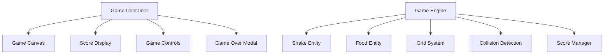
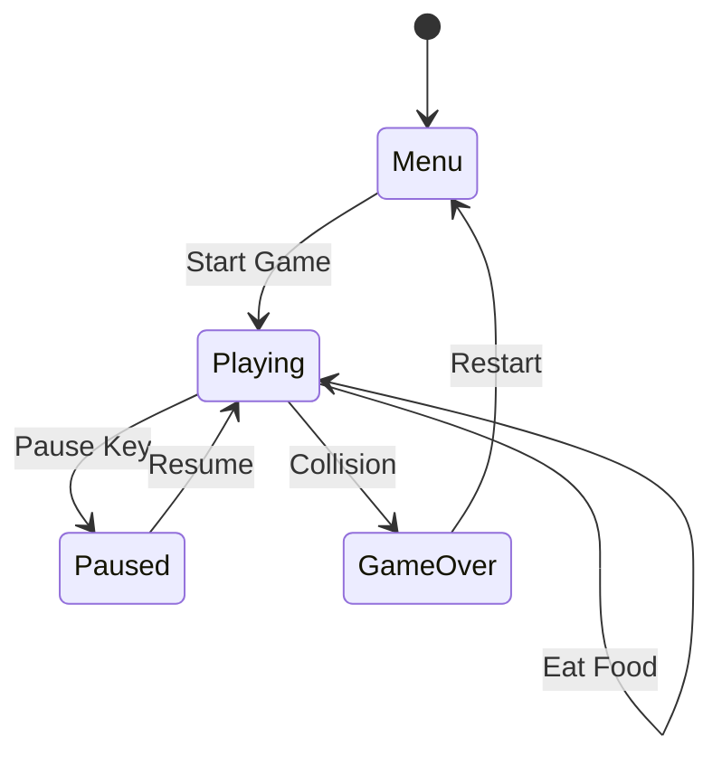

# Snake Game Design Document

## Overview

The Snake Game is a classic arcade-style browser game implemented using vanilla HTML, CSS, and JavaScript. Players control a snake that moves around a grid-based game board, eating food to grow longer while avoiding collisions with walls and the snake's own body.

### Core Features
- Grid-based gameplay with smooth snake movement
- Food generation and consumption mechanics
- Score tracking and display
- Game over detection and restart functionality
- Responsive controls using arrow keys
- Real-time game state updates

### Target Platform
- Web browsers (Chrome, Firefox, Safari, Edge)
- Desktop and tablet devices
- Minimum viewport: 320px width

## Technology Stack & Dependencies

### Core Technologies
- **HTML5**: Game container, canvas element, UI structure
- **CSS3**: Styling, layout, animations, responsive design
- **Vanilla JavaScript (ES6+)**: Game logic, event handling, DOM manipulation

### Browser APIs Used
- Canvas API for game rendering
- RequestAnimationFrame for smooth animation
- Keyboard Event API for controls
- Local Storage API for high score persistence

## Component Architecture

### Component Definition



### Component Hierarchy

#### 1. Game Container Component
**Purpose**: Main wrapper containing all game elements
**Responsibilities**:
- Layout management
- Responsive design container
- Event delegation setup

#### 2. Game Canvas Component
**Purpose**: Primary rendering surface for gameplay
**Responsibilities**:
- Snake rendering
- Food rendering
- Grid background display
- Animation frame management

**Properties**:
- `width`: Canvas width in pixels
- `height`: Canvas height in pixels
- `cellSize`: Size of each grid cell
- `gridWidth`: Number of horizontal cells
- `gridHeight`: Number of vertical cells

#### 3. Score Display Component
**Purpose**: Shows current score and high score
**Responsibilities**:
- Real-time score updates
- High score persistence
- Score formatting and display

**State**:
- `currentScore`: Current game score
- `highScore`: Highest recorded score
- `isNewRecord`: Boolean for new high score indication

#### 4. Game Controls Component
**Purpose**: Input handling and control instructions
**Responsibilities**:
- Keyboard event capturing
- Touch/swipe gesture support (mobile)
- Control instruction display

#### 5. Game Over Modal Component
**Purpose**: End game display with restart options
**Responsibilities**:
- Final score display
- Restart game functionality
- High score celebration

### Props/State Management

#### Global Game State
```javascript
const gameState = {
  isPlaying: false,
  isPaused: false,
  score: 0,
  highScore: 0,
  snake: {
    body: [{x: 10, y: 10}],
    direction: {x: 1, y: 0},
    nextDirection: {x: 1, y: 0}
  },
  food: {
    x: 15,
    y: 15
  },
  gameSpeed: 150
};
```

#### Component State Examples

**Snake Component State**:
- `body`: Array of coordinate objects representing snake segments
- `direction`: Current movement direction vector
- `nextDirection`: Queued direction for next frame
- `isGrowing`: Boolean indicating if snake should grow

**Food Component State**:
- `position`: {x, y} coordinates on grid
- `type`: Food type (normal, bonus, etc.)
- `isActive`: Boolean for food availability

### Lifecycle Methods/Hooks

#### Game Loop Lifecycle
1. **Initialize**: Setup canvas, load high scores, initialize entities
2. **Update**: Process input, update snake position, check collisions
3. **Render**: Clear canvas, draw grid, draw snake, draw food
4. **Cleanup**: Handle game over, save scores, reset state

#### Component Lifecycle Events
```javascript
// Game initialization
function initGame() {
  setupCanvas();
  loadHighScore();
  resetGameState();
  bindEventListeners();
}

// Game update cycle
function gameUpdate() {
  processInput();
  updateSnake();
  checkCollisions();
  updateScore();
}

// Rendering cycle
function gameRender() {
  clearCanvas();
  drawGrid();
  drawFood();
  drawSnake();
  updateUI();
}
```

### Example Component Usage

#### Snake Entity Usage
```javascript
class Snake {
  constructor(initialPosition) {
    this.body = [initialPosition];
    this.direction = {x: 1, y: 0};
    this.growing = false;
  }
  
  move() {
    const head = {...this.body[0]};
    head.x += this.direction.x;
    head.y += this.direction.y;
    
    this.body.unshift(head);
    
    if (!this.growing) {
      this.body.pop();
    } else {
      this.growing = false;
    }
  }
  
  grow() {
    this.growing = true;
  }
  
  checkSelfCollision() {
    const head = this.body[0];
    return this.body.slice(1).some(segment => 
      segment.x === head.x && segment.y === head.y
    );
  }
}
```

## Styling Strategy

### CSS Architecture
- **Base Styles**: Reset, typography, color variables
- **Layout Styles**: Grid system, flexbox containers
- **Component Styles**: Individual component styling
- **Utility Classes**: Common patterns, responsive helpers
- **Animation Styles**: Smooth transitions, game effects

### Design System
```css
:root {
  --primary-color: #4CAF50;
  --secondary-color: #FFC107;
  --danger-color: #F44336;
  --background-color: #1a1a1a;
  --text-color: #ffffff;
  --grid-color: rgba(255, 255, 255, 0.1);
  
  --cell-size: 20px;
  --border-radius: 4px;
  --animation-speed: 0.2s;
}
```

### Responsive Design
- Mobile-first approach
- Breakpoints: 320px, 768px, 1024px
- Touch-friendly controls for mobile
- Scalable game board based on viewport

## State Management

### Game State Architecture


### State Management Pattern
- **Centralized State**: Single source of truth for game state
- **Immutable Updates**: Pure functions for state changes
- **Event-Driven**: State changes triggered by game events
- **Local Storage**: Persistent storage for high scores

### State Update Flow
```javascript
// State update pattern
function updateGameState(action, payload) {
  switch(action) {
    case 'MOVE_SNAKE':
      return updateSnakePosition(gameState, payload);
    case 'EAT_FOOD':
      return handleFoodConsumption(gameState, payload);
    case 'GAME_OVER':
      return handleGameOver(gameState);
    default:
      return gameState;
  }
}
```

## API Integration Layer

### Local Storage Management
```javascript
class ScoreManager {
  saveHighScore(score) {
    localStorage.setItem('snakeHighScore', score.toString());
  }
  
  loadHighScore() {
    return parseInt(localStorage.getItem('snakeHighScore')) || 0;
  }
  
  checkNewRecord(currentScore) {
    const highScore = this.loadHighScore();
    return currentScore > highScore;
  }
}
```

### Configuration Management
```javascript
const gameConfig = {
  canvas: {
    width: 400,
    height: 400,
    cellSize: 20
  },
  gameplay: {
    initialSpeed: 150,
    speedIncrease: 5,
    pointsPerFood: 10
  },
  controls: {
    keys: {
      up: 'ArrowUp',
      down: 'ArrowDown',
      left: 'ArrowLeft',
      right: 'ArrowRight',
      pause: 'Space'
    }
  }
};
```

## Game Logic Architecture

### Core Game Systems

#### 1. Grid System
```javascript
class GridSystem {
  constructor(width, height, cellSize) {
    this.width = width;
    this.height = height;
    this.cellSize = cellSize;
    this.cols = Math.floor(width / cellSize);
    this.rows = Math.floor(height / cellSize);
  }
  
  isValidPosition(x, y) {
    return x >= 0 && x < this.cols && y >= 0 && y < this.rows;
  }
  
  getRandomPosition() {
    return {
      x: Math.floor(Math.random() * this.cols),
      y: Math.floor(Math.random() * this.rows)
    };
  }
}
```

#### 2. Collision Detection System
```javascript
class CollisionDetector {
  checkWallCollision(snake, grid) {
    const head = snake.body[0];
    return !grid.isValidPosition(head.x, head.y);
  }
  
  checkSelfCollision(snake) {
    const head = snake.body[0];
    return snake.body.slice(1).some(segment => 
      segment.x === head.x && segment.y === head.y
    );
  }
  
  checkFoodCollision(snake, food) {
    const head = snake.body[0];
    return head.x === food.x && head.y === food.y;
  }
}
```

#### 3. Food Generation System
```javascript
class FoodManager {
  generateFood(snake, grid) {
    let position;
    do {
      position = grid.getRandomPosition();
    } while (this.isPositionOccupied(position, snake));
    
    return position;
  }
  
  isPositionOccupied(position, snake) {
    return snake.body.some(segment => 
      segment.x === position.x && segment.y === position.y
    );
  }
}
```

### Game Loop Implementation
```javascript
class GameEngine {
  constructor() {
    this.isRunning = false;
    this.lastTime = 0;
    this.accumulator = 0;
    this.timestep = 1000 / 60; // 60 FPS
  }
  
  start() {
    this.isRunning = true;
    requestAnimationFrame(this.gameLoop.bind(this));
  }
  
  gameLoop(currentTime) {
    if (!this.isRunning) return;
    
    const deltaTime = currentTime - this.lastTime;
    this.lastTime = currentTime;
    this.accumulator += deltaTime;
    
    while (this.accumulator >= this.timestep) {
      this.update(this.timestep);
      this.accumulator -= this.timestep;
    }
    
    this.render();
    requestAnimationFrame(this.gameLoop.bind(this));
  }
  
  update(deltaTime) {
    this.processInput();
    this.updateGameObjects(deltaTime);
    this.checkCollisions();
    this.updateGameState();
  }
  
  render() {
    this.clearCanvas();
    this.drawBackground();
    this.drawGameObjects();
    this.drawUI();
  }
}
```

## Testing Strategy

### Unit Testing Structure
```javascript
// Snake movement tests
describe('Snake Movement', () => {
  test('should move right by default', () => {
    const snake = new Snake({x: 5, y: 5});
    snake.move();
    expect(snake.body[0]).toEqual({x: 6, y: 5});
  });
  
  test('should grow when eating food', () => {
    const snake = new Snake({x: 5, y: 5});
    const initialLength = snake.body.length;
    snake.grow();
    snake.move();
    expect(snake.body.length).toBe(initialLength + 1);
  });
});

// Collision detection tests
describe('Collision Detection', () => {
  test('should detect wall collision', () => {
    const snake = new Snake({x: -1, y: 5});
    const grid = new GridSystem(400, 400, 20);
    const detector = new CollisionDetector();
    expect(detector.checkWallCollision(snake, grid)).toBe(true);
  });
  
  test('should detect food collision', () => {
    const snake = new Snake({x: 5, y: 5});
    const food = {x: 5, y: 5};
    const detector = new CollisionDetector();
    expect(detector.checkFoodCollision(snake, food)).toBe(true);
  });
});
```

### Integration Testing
- Game flow testing (start → play → game over → restart)
- Input handling verification
- Score persistence testing
- Canvas rendering validation

### Manual Testing Checklist
- [ ] Snake moves smoothly in all directions
- [ ] Snake grows when eating food
- [ ] Game detects collisions correctly
- [ ] Score updates properly
- [ ] High score persists across sessions
- [ ] Game restarts correctly
- [ ] Controls are responsive
- [ ] Game runs at consistent framerate
- [ ] Mobile touch controls work (if implemented)

### Performance Testing
- Frame rate monitoring (target: 60 FPS)
- Memory leak detection during extended play
- Canvas rendering performance optimization
- Input lag measurement and optimization


