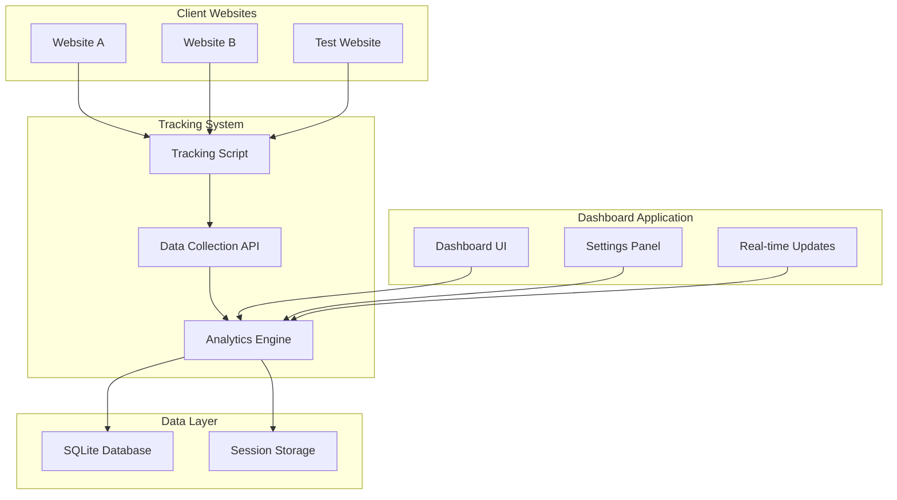
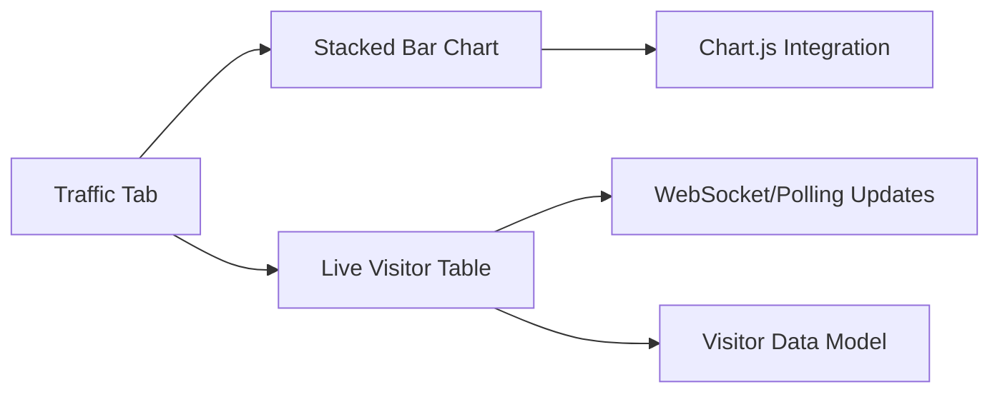
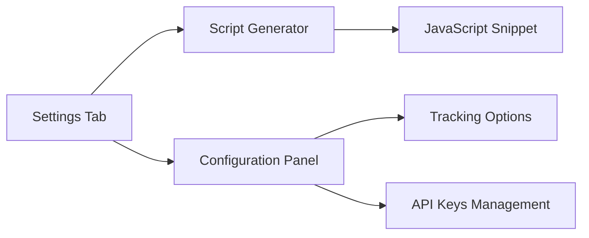
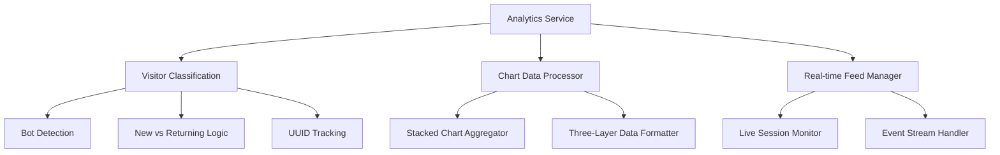
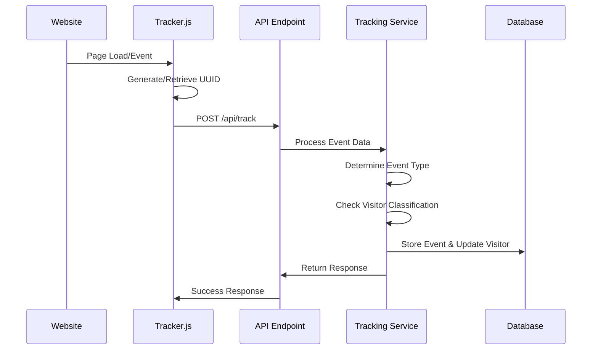
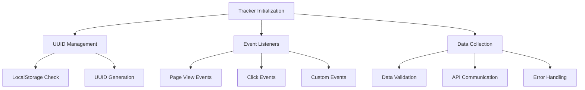
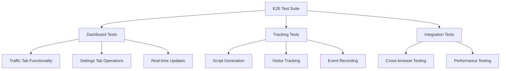
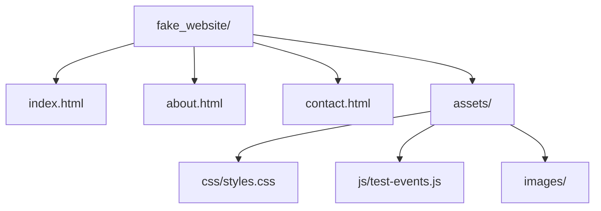

# Visitor Tracking Dashboard - Design Document

## Overview

A PHP-based web application for tracking website visitors with real-time analytics. The system consists of a dashboard interface, a JavaScript tracking script, and a test website for validation. The application focuses on unique visitor tracking with event monitoring capabilities.

**Core Features:**
- Real-time visitor tracking dashboard
- Unique visitor analytics with stacked bar charts
- Live visitor activity feed
- Event tracking capabilities
- JavaScript snippet generation for website integration
- Test website for validation
- End-to-end testing with Playwright

## Technology Stack & Dependencies

### Backend
- **PHP 8.1+** - Server-side application logic
- **SQLite** - Lightweight database for visitor analytics storage
- **Composer** - Dependency management

### Frontend
- **HTML5/CSS3** - Dashboard interface
- **JavaScript (Vanilla)** - Client-side interactions and tracking script
- **Chart.js** - Data visualization for analytics charts
- **Bootstrap 5** - UI framework for responsive design

### Testing
- **Playwright** - End-to-end testing framework
- **PHPUnit** - Unit testing for PHP components

### Development Tools
- **PHP Built-in Server** - Development web server (`php -S`)

## Architecture

### System Architecture Diagram



### Project Directory Structure

```
/
├── public/
│   ├── index.php              # Dashboard main page
│   ├── api/
│   │   ├── track.php          # Visitor tracking endpoint
│   │   ├── analytics.php      # Analytics data API
│   │   └── live-visitors.php  # Real-time visitor feed
│   ├── assets/
│   │   ├── css/
│   │   │   └── dashboard.css
│   │   ├── js/
│   │   │   ├── dashboard.js
│   │   │   └── tracker.js     # Tracking script for websites
│   │   └── vendor/
├── src/
│   ├── Controllers/
│   │   ├── DashboardController.php
│   │   ├── AnalyticsController.php
│   │   └── TrackingController.php
│   ├── Models/
│   │   ├── Visitor.php
│   │   └── Event.php
│   ├── Services/
│   │   ├── AnalyticsService.php
│   │   ├── TrackingService.php
│   │   └── UniqueVisitorService.php
│   └── Database/
│       ├── Connection.php
│       └── migrations/
├── fake_website/
│   ├── index.html
│   ├── about.html
│   ├── contact.html
│   └── assets/
├── tests/
│   ├── e2e/
│   │   └── playwright/
│   └── unit/
│       └── php/
├── config/
│   ├── database.php
│   └── app.php
├── storage/
│   └── analytics.sqlite
├── composer.json
├── package.json
└── README.md
```

## Component Architecture

### Dashboard Components

#### 1. Traffic Analytics Component


**Chart Structure (Bottom to Top):**
- **Bottom Layer**: Bots (automated traffic)
- **Middle Layer**: New Visitors (first-time visitors)
- **Top Layer**: Returning Visitors (repeat visitors)

**Responsibilities:**
- Display visitor categorization in three-layer stacked bar format
- Show real-time visitor activity feed
- Handle time-based filtering (daily, weekly, monthly)
- Manage chart data updates with visitor type segmentation

#### 2. Settings Component


**Responsibilities:**
- Generate tracking script snippets
- Configure tracking parameters
- Manage site-specific settings
- Display integration instructions

### Data Models & Database Schema

#### Visitors Table
| Field | Type | Description |
|-------|------|-------------|
| id | INTEGER PRIMARY KEY | Unique visitor identifier |
| visitor_uuid | VARCHAR(36) | UUID for unique visitor tracking |
| ip_address | VARCHAR(45) | Visitor IP address (hashed) |
| user_agent | TEXT | Browser user agent |
| visitor_type | ENUM('bot','new','returning') | Visitor classification |
| first_visit | INTEGER | First visit timestamp (milliseconds) |
| last_visit | INTEGER | Last visit timestamp (milliseconds) |
| visit_count | INTEGER | Total number of visits |

#### Events Table
| Field | Type | Description |
|-------|------|-------------|
| id | INTEGER PRIMARY KEY | Event identifier |
| visitor_id | INTEGER | Foreign key to visitors |
| event_type | VARCHAR(50) | Type of event (pageview, click, scroll, custom) |
| page_url | VARCHAR(500) | Page URL where event occurred |
| page_title | VARCHAR(200) | Page title (for pageview events) |
| referrer | VARCHAR(500) | Referrer URL (for pageview events) |
| event_data | JSON | Additional event data |
| session_id | VARCHAR(32) | Session identifier |
| timestamp | INTEGER | Event timestamp (milliseconds) |

### Business Logic Layer

#### Analytics Service Architecture



#### Tracking Service Flow



## API Endpoints Reference

### Tracking API

#### POST /api/track.php
**Purpose:** Record visitor activity and events

**Request Schema:**
```json
{
  "visitor_uuid": "string (UUID)",
  "event_type": "pageview|click|scroll|custom",
  "page_url": "string",
  "page_title": "string (optional, for pageview events)",
  "referrer": "string (optional, for pageview events)",
  "event_data": "object (optional, for custom events)",
  "timestamp": "integer (milliseconds since epoch)"
}
```

**Response Schema:**
```json
{
  "status": "success|error",
  "visitor_id": "integer",
  "session_id": "string",
  "message": "string"
}
```

#### GET /api/analytics.php
**Purpose:** Retrieve analytics data for dashboard charts

**Query Parameters:**
- `period`: daily|weekly|monthly
- `start_date`: YYYY-MM-DD
- `end_date`: YYYY-MM-DD

**Response Schema:**
```json
{
  "visitor_data": [
    {
      "date": "YYYY-MM-DD",
      "bots": "integer",
      "new_visitors": "integer",
      "returning_visitors": "integer",
      "total": "integer"
    }
  ],
  "total_events": "integer",
  "total_pageviews": "integer",
  "total_unique_visitors": "integer"
}
```

#### GET /api/live-visitors.php
**Purpose:** Real-time visitor activity feed

**Response Schema:**
```json
{
  "live_visitors": [
    {
      "visitor_uuid": "string",
      "page_url": "string",
      "timestamp": "integer (milliseconds since epoch)",
      "event_type": "string"
    }
  ],
  "active_count": "integer"
}
```

### Authentication Requirements
- API key validation for tracking endpoints
- CORS configuration for cross-domain tracking
- Rate limiting to prevent abuse

## JavaScript Tracking Script

### Tracker.js Architecture



### Integration Example

```javascript
// Generated tracking snippet
(function() {
  var script = document.createElement('script');
  script.src = 'https://your-domain.com/assets/js/tracker.js';
  script.setAttribute('data-site-id', 'YOUR_SITE_ID');
  script.setAttribute('data-api-url', 'https://your-domain.com/api/track.php');
  document.head.appendChild(script);
})();
```

## Testing Strategy

### End-to-End Testing with Playwright

#### Test Scenarios



#### Test Configuration

**File: tests/e2e/playwright.config.js**
```javascript
module.exports = {
  testDir: './tests',
  projects: [
    {
      name: 'chromium',
      use: { ...devices['Desktop Chrome'] },
    },
    {
      name: 'firefox',
      use: { ...devices['Desktop Firefox'] },
    },
  ],
  webServer: {
    command: 'php -S localhost:8000 -t public',
    port: 8000,
  },
};
```

### Unit Testing

#### PHP Unit Tests
- **AnalyticsService** - Data aggregation logic
- **TrackingService** - Visitor identification and recording
- **UniqueVisitorService** - UUID-based deduplication
- **Database Models** - CRUD operations validation

## Fake Website for Testing

### Test Website Structure



### Test Scenarios Implementation

**File: fake_website/index.html**
- Tracking script integration
- Multiple page navigation
- Event trigger buttons
- Form submissions
- Custom event tracking

**Features for Testing:**
- Page view tracking validation
- Unique visitor detection
- Cross-page session tracking
- Event recording accuracy
- Real-time dashboard updates

## Development Server Setup

### Running the Application

The application uses PHP's built-in development server, eliminating the need for Apache or Nginx configuration.

**Start the server:**
```bash
# Navigate to project root
cd /path/to/gogol_analitics

# Start PHP built-in server
php -S localhost:8000 -t public
```

**Access Points:**
- Dashboard: `http://localhost:8000`
- API Endpoints: `http://localhost:8000/api/`
- Tracking Script: `http://localhost:8000/assets/js/tracker.js`

**Development Benefits:**
- No web server configuration required
- Simple routing through PHP
- Direct file serving from public directory
- Easy debugging and development

## Configuration Management

### Environment Configuration

**File: config/app.php**
```php
<?php
return [
    'app_name' => 'Visitor Tracking Dashboard',
    'timezone' => 'UTC',
    'server_host' => 'localhost',
    'server_port' => 8000,
    'api_rate_limit' => 1000, // requests per hour
    'session_timeout' => 1800, // 30 minutes
    'cors_origins' => ['*'], // Configure for production
];
```

**File: config/database.php**
```php
<?php
return [
    'driver' => 'sqlite',
    'database' => __DIR__ . '/../storage/analytics.sqlite',
    'charset' => 'utf8mb4',
    'prefix' => '',
    'foreign_key_constraints' => true,
    'journal_mode' => 'WAL', // Write-Ahead Logging for better performance
];
```

## Security Considerations

### Data Protection
- IP address hashing for privacy compliance
- UUID-based visitor identification
- HTTPS enforcement for tracking endpoints
- CORS policy configuration

### Input Validation
- URL validation for tracking data
- Event data sanitization
- SQL injection prevention
- XSS protection for dashboard

### Rate Limiting
- API endpoint throttling
- Visitor tracking frequency limits
- Dashboard access controls